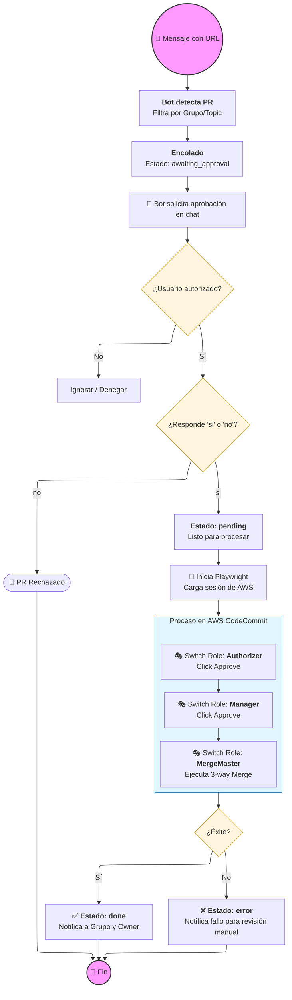

## Contexto/Funcionalidad

Este repositorio detalla el funcionamiento de un bot de Telegram diseñado para gestionar de forma automatizada la revisión y fusión de cambios en AWS CodeCommit. 

La herramienta opera mediante un sistema de cola de mensajes donde usuarios autorizados validan las solicitudes antes de que un navegador automatizado ejecute las acciones en la nube. 

Al recibir una orden, el software utiliza Playwright para simular la navegación humana, realizando los cambios de roles necesarios y completando el merge de código de manera secuencial. 

El sistema garantiza la seguridad y persistencia de los datos mediante el almacenamiento de sesiones, registros históricos y una configuración rigurosa de variables de entorno. 

Además, incluye mecanismos de notificación personalizada para informar a los desarrolladores sobre el estado final de sus integraciones tecnológicas. Su arquitectura permite manejar múltiples solicitudes simultáneas, organizándolas a través de diversos estados de procesamiento para evitar conflictos en el entorno de desarrollo.

## Diagrama de flujo

