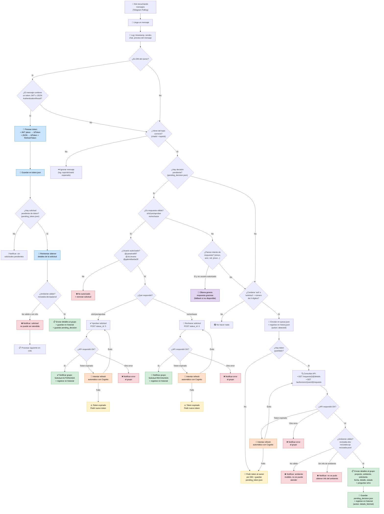
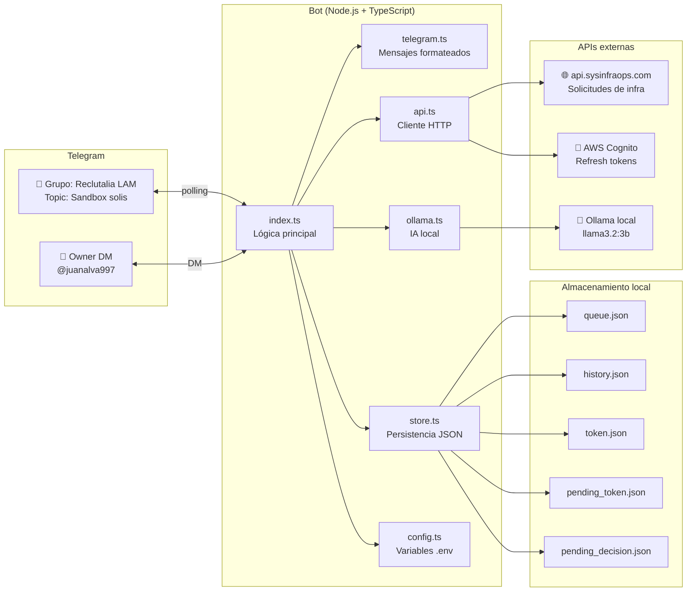
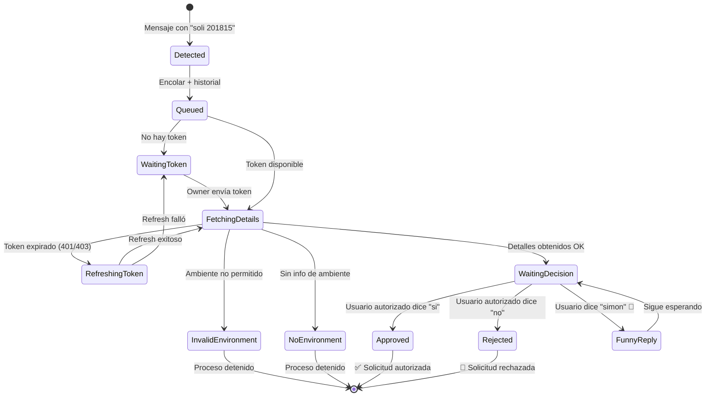

# Diagrama de flujo — Reclutalia Autorizador Solis Bot

```mermaid
flowchart TD
    START["🤖 Bot escuchando mensajes<br/>(Telegram Polling)"]

    START --> MSG["📩 Llega un mensaje"]
    MSG --> LOG["📝 Log: timestamp, sender,<br/>chat, preview del mensaje"]
    LOG --> IS_DM{"¿Es DM del owner?"}

    %% ===== FLUJO DE TOKEN =====
    IS_DM -->|Sí| HAS_TOKEN_DATA{"¿El mensaje contiene<br/>un token JWT o JSON<br/>AuthenticationResult?"}
    HAS_TOKEN_DATA -->|No| CHECK_TOPIC
    HAS_TOKEN_DATA -->|Sí| PARSE_TOKEN["🔑 Parsear token:<br/>• JWT plano → IdToken<br/>• JSON → IdToken + RefreshToken"]
    PARSE_TOKEN --> SAVE_TOKEN["💾 Guardar en token.json"]
    SAVE_TOKEN --> HAS_PENDING_TOKEN{"¿Hay solicitud<br/>pendiente de token?<br/>(pending_token.json)"}
    HAS_PENDING_TOKEN -->|No| NOTIFY_NO_PENDING["ℹ️ Notificar: sin<br/>solicitudes pendientes"]
    HAS_PENDING_TOKEN -->|Sí| RETRY_WITH_TOKEN["🔄 Reintentar obtener<br/>detalles de la solicitud"]
    RETRY_WITH_TOKEN --> VALIDATE_ENV_RETRY{"¿Ambiente válido?<br/>reclutalia-dev/qa/prod"}
    VALIDATE_ENV_RETRY -->|No válido o sin info| REJECT_ENV_RETRY["⛔ Notificar: solicitud<br/>no puede ser atendida"]
    REJECT_ENV_RETRY --> NEXT_QUEUE_2["📋 Procesar siguiente en cola"]
    VALIDATE_ENV_RETRY -->|Sí| SHOW_DETAILS_RETRY["📋 Enviar detalles al grupo<br/>+ guardar en historial<br/>+ guardar pending_decision"]

    %% ===== FILTRO DE TOPIC =====
    IS_DM -->|No| CHECK_TOPIC{"¿Viene del topic<br/>correcto?<br/>(chatId + topicId)"}
    CHECK_TOPIC -->|No| IGNORE["⏭️ Ignorar mensaje<br/>(log: topicId/chatId esperado)"]
    CHECK_TOPIC -->|Sí| HAS_PENDING{"¿Hay decisión<br/>pendiente?<br/>(pending_decision.json)"}

    %% ===== FLUJO DE DECISIÓN =====
    HAS_PENDING -->|Sí| IS_VALID_ANSWER{"¿Es respuesta válida?<br/>si/sí/yes/aprobar<br/>no/rechazar"}
    IS_VALID_ANSWER -->|Sí| IS_AUTHORIZED{"¿Usuario autorizado?<br/>@juanalva997<br/>@JcLievano<br/>@gabrielbarba28"}
    IS_AUTHORIZED -->|No| UNAUTHORIZED["⛔ No autorizado<br/>+ reenviar solicitud"]
    IS_AUTHORIZED -->|Sí| WHICH_ANSWER{"¿Qué respondió?"}

    WHICH_ANSWER -->|si/sí/yes/aprobar| APPROVE["✅ Aprobar solicitud<br/>POST status_id: 5"]
    WHICH_ANSWER -->|no/rechazar| REJECT["🚫 Rechazar solicitud<br/>POST status_id: 6"]

    APPROVE --> APPROVE_OK{"¿API respondió OK?"}
    APPROVE_OK -->|Sí| APPROVE_SUCCESS["✅ Notificar grupo:<br/>Solicitud AUTORIZADA<br/>+ registrar en historial"]
    APPROVE_OK -->|Token expirado| TRY_REFRESH_A["🔄 Intentar refresh<br/>automático con Cognito"]
    TRY_REFRESH_A -->|Éxito| APPROVE
    TRY_REFRESH_A -->|Fallo| TOKEN_EXPIRED_MSG_A["⚠️ Token expirado<br/>Pedir nuevo token"]
    APPROVE_OK -->|Otro error| APPROVE_ERROR["❌ Notificar error<br/>al grupo"]

    REJECT --> REJECT_OK{"¿API respondió OK?"}
    REJECT_OK -->|Sí| REJECT_SUCCESS["🚫 Notificar grupo:<br/>Solicitud RECHAZADA<br/>+ registrar en historial"]
    REJECT_OK -->|Token expirado| TRY_REFRESH_R["🔄 Intentar refresh<br/>automático con Cognito"]
    TRY_REFRESH_R -->|Éxito| REJECT
    TRY_REFRESH_R -->|Fallo| TOKEN_EXPIRED_MSG_R["⚠️ Token expirado<br/>Pedir nuevo token"]
    REJECT_OK -->|Otro error| REJECT_ERROR["❌ Notificar error<br/>al grupo"]

    %% ===== RESPUESTA INVÁLIDA CON IA =====
    IS_VALID_ANSWER -->|No| IS_FUNNY{"¿Parece intento de<br/>respuesta? (simon,<br/>arre, nel, jimon...)"}
    IS_FUNNY -->|Sí y es usuario autorizado| OLLAMA["🤖 Ollama genera<br/>respuesta graciosa<br/>(fallback si no disponible)"]
    IS_FUNNY -->|No| CHECK_SOLI

    %% ===== FLUJO DE SOLICITUD =====
    HAS_PENDING -->|No| CHECK_SOLI{"¿Contiene 'soli' o<br/>'solicitud' + número<br/>de 6 dígitos?"}
    CHECK_SOLI -->|No| END_IGNORE["🔇 No hacer nada"]
    CHECK_SOLI -->|Sí| ENQUEUE["📝 Encolar en queue.json<br/>+ registrar en history.json<br/>(action: detected)"]
    ENQUEUE --> HAS_API_TOKEN{"¿Hay token<br/>guardado?"}
    HAS_API_TOKEN -->|No| REQUEST_TOKEN["🔐 Pedir token al owner<br/>por DM + guardar<br/>pending_token.json"]
    HAS_API_TOKEN -->|Sí| FETCH_DETAILS["🔍 Consultar API:<br/>• GET /requests/{id}/details<br/>• GET /authorizers/{userId}/requests"]

    FETCH_DETAILS --> FETCH_OK{"¿API respondió OK?"}
    FETCH_OK -->|Sí| VALIDATE_ENV{"¿Ambiente válido?<br/>reclutalia-dev<br/>reclutalia-qa<br/>reclutalia-prod"}
    VALIDATE_ENV -->|No válido| REJECT_ENV["⛔ Notificar: ambiente<br/>inválido, no se puede<br/>atender"]
    VALIDATE_ENV -->|Sin info de ambiente| REJECT_NO_ENV["⛔ Notificar: no se pudo<br/>obtener info del ambiente"]
    VALIDATE_ENV -->|Sí| SHOW_DETAILS["📋 Enviar detalles al grupo:<br/>proyecto, ambiente, solicitante,<br/>fecha, detalle, estado<br/>+ preguntar si/no"]
    SHOW_DETAILS --> SAVE_DECISION["💾 Guardar pending_decision.json<br/>+ registrar en historial<br/>(action: details_fetched)"]

    FETCH_OK -->|Token expirado| TRY_REFRESH_F["🔄 Intentar refresh<br/>automático con Cognito"]
    TRY_REFRESH_F -->|Éxito| FETCH_DETAILS
    TRY_REFRESH_F -->|Fallo| REQUEST_TOKEN
    FETCH_OK -->|Otro error| FETCH_ERROR["❌ Notificar error<br/>al grupo"]

    %% ===== ESTILOS =====
    classDef green fill:#d4edda,stroke:#28a745,color:#000
    classDef red fill:#f8d7da,stroke:#dc3545,color:#000
    classDef blue fill:#cce5ff,stroke:#007bff,color:#000
    classDef yellow fill:#fff3cd,stroke:#ffc107,color:#000
    classDef purple fill:#e2d5f1,stroke:#6f42c1,color:#000
    classDef orange fill:#ffe0cc,stroke:#fd7e14,color:#000

    class APPROVE_SUCCESS,REJECT_SUCCESS,SHOW_DETAILS,SHOW_DETAILS_RETRY,SAVE_DECISION green
    class REJECT_ENV,REJECT_NO_ENV,REJECT_ENV_RETRY,APPROVE_ERROR,REJECT_ERROR,FETCH_ERROR,UNAUTHORIZED red
    class PARSE_TOKEN,SAVE_TOKEN,RETRY_WITH_TOKEN blue
    class REQUEST_TOKEN,TOKEN_EXPIRED_MSG_A,TOKEN_EXPIRED_MSG_R yellow
    class OLLAMA purple
    class TRY_REFRESH_A,TRY_REFRESH_R,TRY_REFRESH_F orange
```

## Arquitectura de componentes

```mermaid
graph LR
    subgraph "Telegram"
        GROUP["👥 Grupo: Reclutalia LAM<br/>Topic: Sandbox solis"]
        OWNER["👤 Owner DM<br/>@juanalva997"]
    end

    subgraph "Bot (Node.js + TypeScript)"
        INDEX["index.ts<br/>Lógica principal"]
        TG["telegram.ts<br/>Mensajes formateados"]
        API["api.ts<br/>Cliente HTTP"]
        STORE["store.ts<br/>Persistencia JSON"]
        OLLAMA_SVC["ollama.ts<br/>IA local"]
        CONFIG["config.ts<br/>Variables .env"]
    end

    subgraph "Almacenamiento local"
        QUEUE["queue.json"]
        HISTORY["history.json"]
        TOKEN["token.json"]
        PENDING_T["pending_token.json"]
        PENDING_D["pending_decision.json"]
    end

    subgraph "APIs externas"
        SYSINFRA["🌐 api.sysinfraops.com<br/>Solicitudes de infra"]
        COGNITO["🔐 AWS Cognito<br/>Refresh tokens"]
        OLLAMA_API["🤖 Ollama local<br/>llama3.2:3b"]
    end

    GROUP <-->|polling| INDEX
    OWNER <-->|DM| INDEX
    INDEX --> TG
    INDEX --> API
    INDEX --> STORE
    INDEX --> OLLAMA_SVC
    INDEX --> CONFIG
    STORE --> QUEUE
    STORE --> HISTORY
    STORE --> TOKEN
    STORE --> PENDING_T
    STORE --> PENDING_D
    API --> SYSINFRA
    API --> COGNITO
    OLLAMA_SVC --> OLLAMA_API
```

## Ciclo de vida de una solicitud

```mermaid
stateDiagram-v2
    [*] --> Detected: Mensaje con "soli 201815"
    Detected --> Queued: Encolar + historial

    Queued --> WaitingToken: No hay token
    WaitingToken --> FetchingDetails: Owner envía token

    Queued --> FetchingDetails: Token disponible

    FetchingDetails --> RefreshingToken: Token expirado (401/403)
    RefreshingToken --> FetchingDetails: Refresh exitoso
    RefreshingToken --> WaitingToken: Refresh falló

    FetchingDetails --> InvalidEnvironment: Ambiente no permitido
    FetchingDetails --> NoEnvironment: Sin info de ambiente
    FetchingDetails --> WaitingDecision: Detalles obtenidos OK

    InvalidEnvironment --> [*]: Proceso detenido
    NoEnvironment --> [*]: Proceso detenido

    WaitingDecision --> Approved: Usuario autorizado dice "si"
    WaitingDecision --> Rejected: Usuario autorizado dice "no"
    WaitingDecision --> FunnyReply: Usuario dice "simon" 🤡
    FunnyReply --> WaitingDecision: Sigue esperando

    Approved --> [*]: ✅ Solicitud autorizada
    Rejected --> [*]: 🚫 Solicitud rechazada
```
