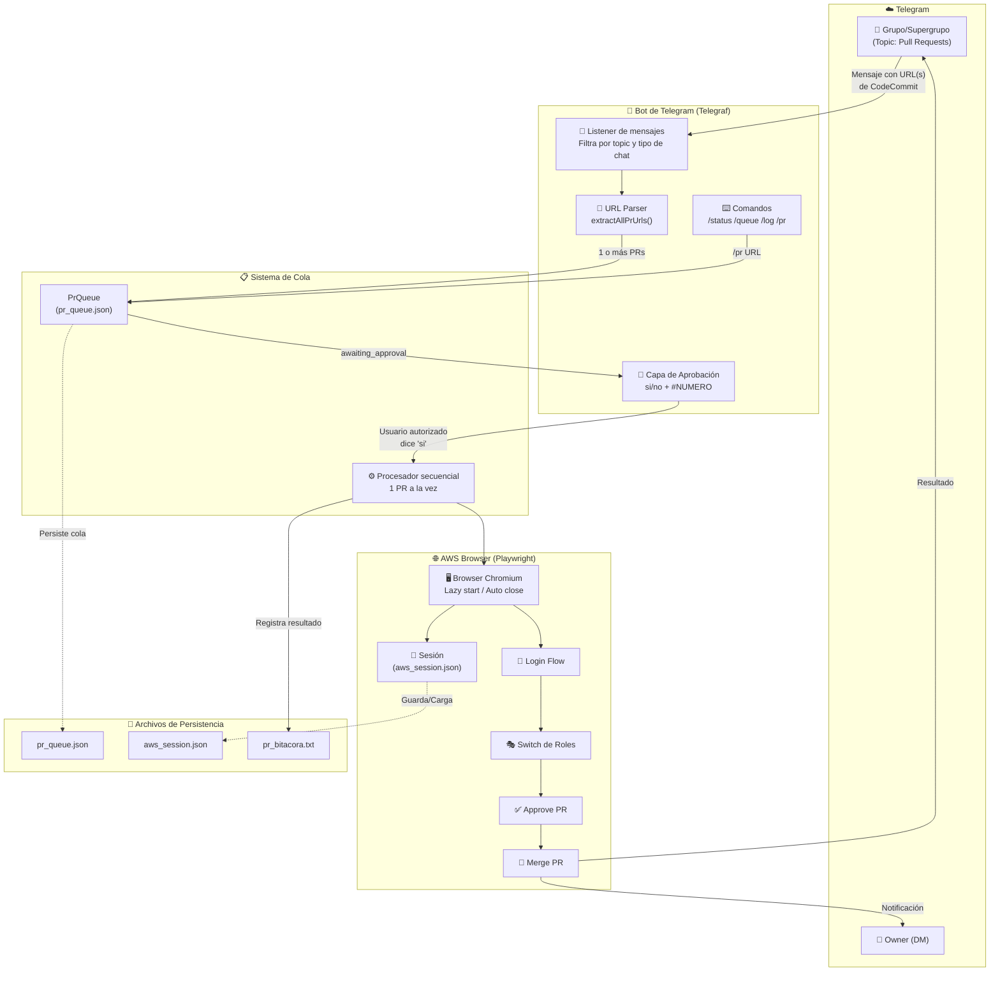
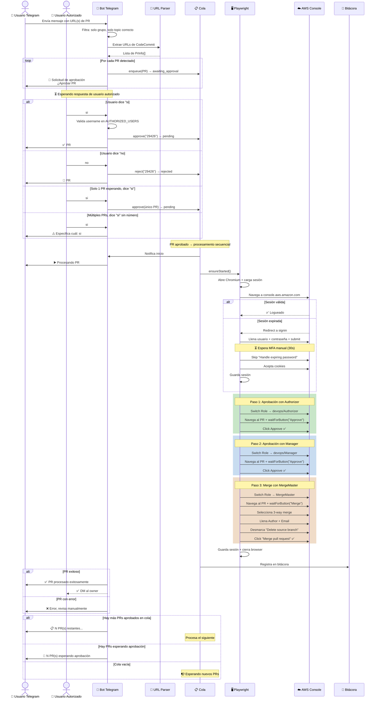
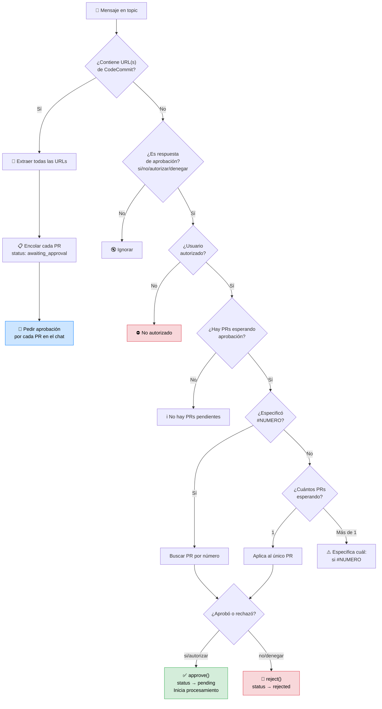
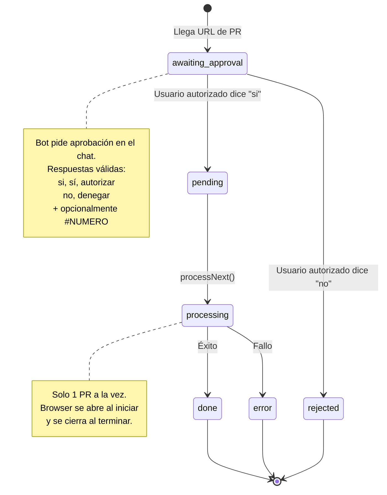
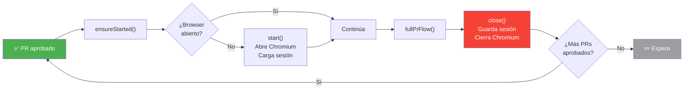
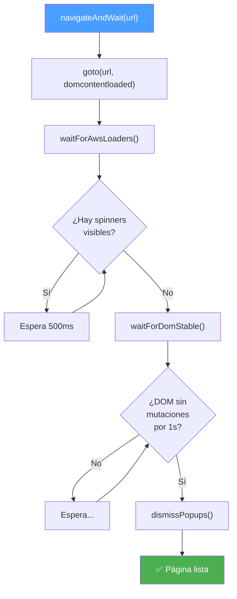

# Diagrama de Flujo — reclutalia-aws-pr-bot

## Arquitectura General

## Flujo Completo de un PR (con aprobación)

## Flujo de Aprobación (detalle)

## Sistema de Cola (estados)

## Ciclo de Vida del Browser

## Navegación Robusta

