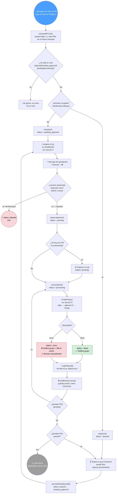
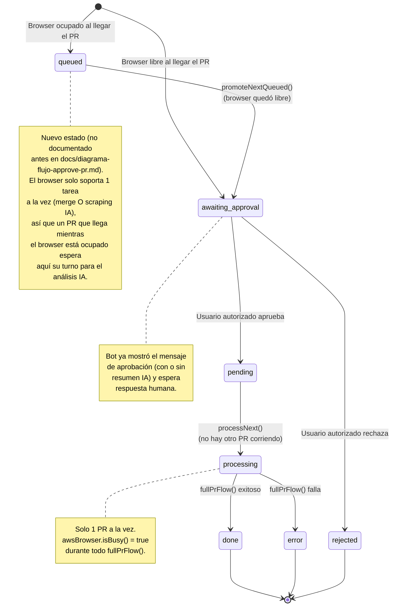
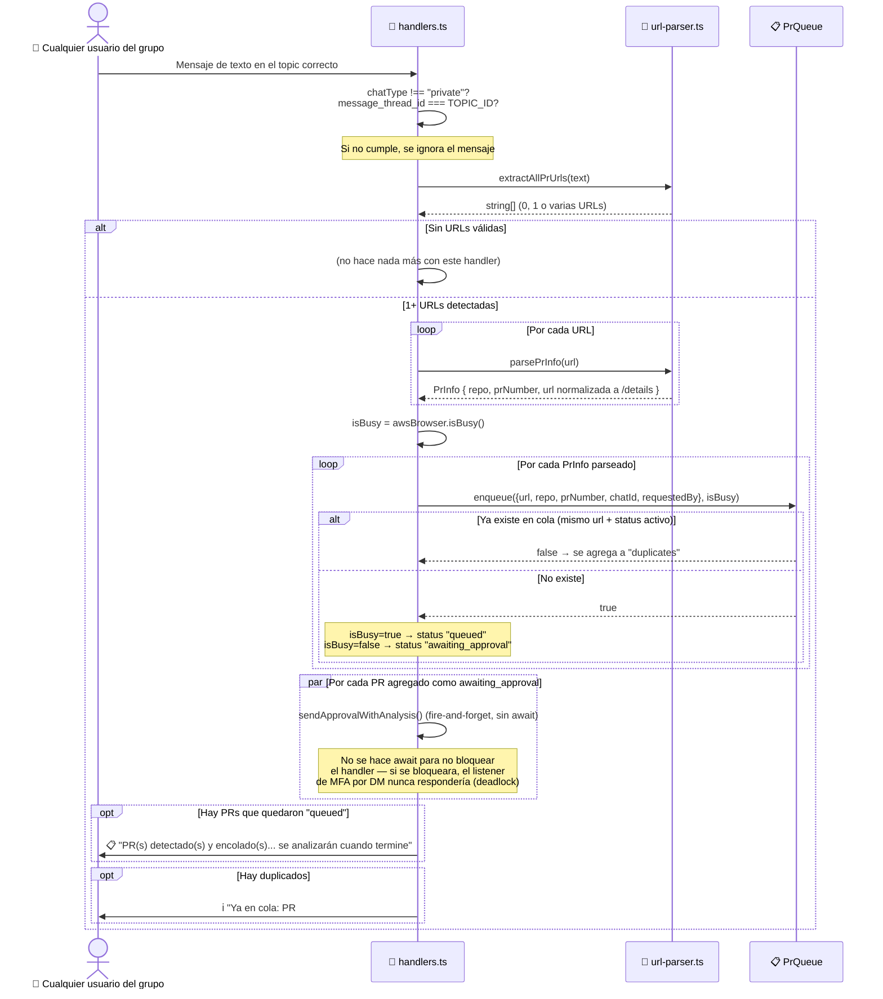
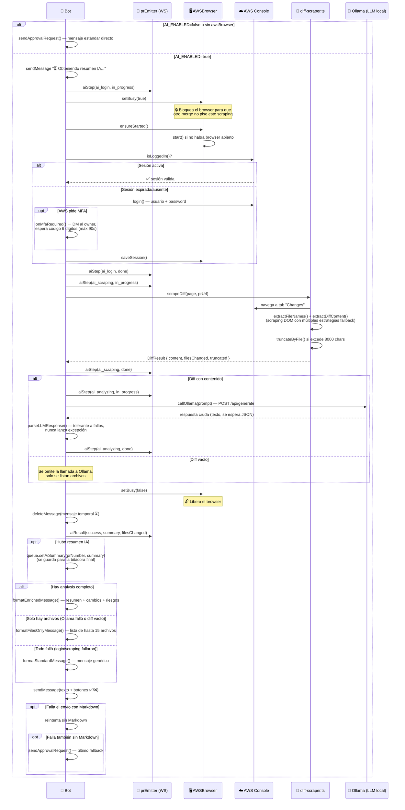
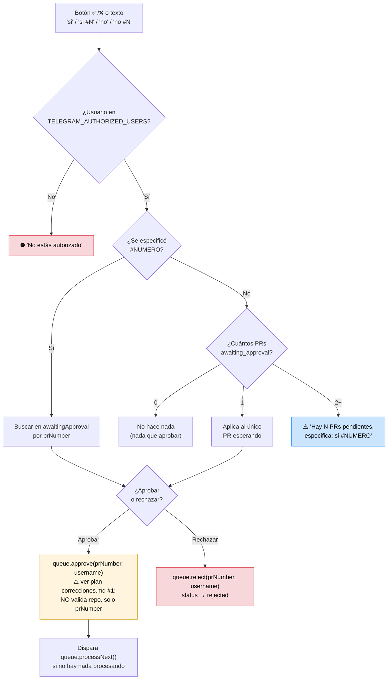
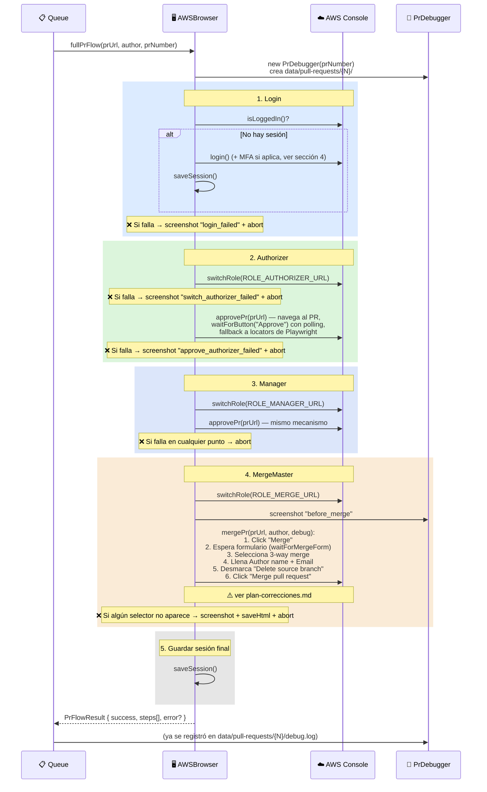
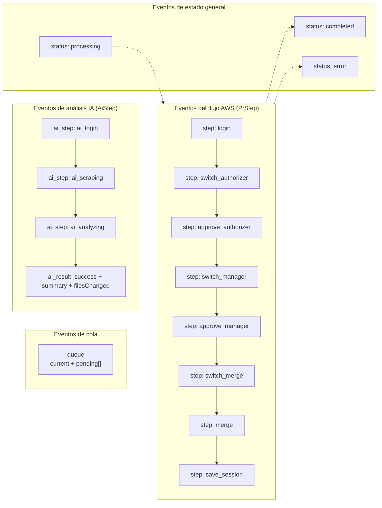

# Ciclo de vida completo de un PR

> Diagrama a detalle desde que llega el mensaje con la URL hasta que el PR queda `done`, `error` o `rejected`.
> Actualiza y complementa `docs/diagrama-flujo-approve-pr.md`, que no cubre el análisis con IA (`AI_ENABLED=true`), el estado `queued` (browser ocupado) ni los eventos WebSocket emitidos para el widget.
>
> Nota: se generó con diagramas Mermaid (misma convención ya usada en `docs/diagrama-flujo-approve-pr.md`) — no se usó una skill de terceros de diagramación porque no está disponible en este entorno.

## Índice

1. [Vista general end-to-end](#1-vista-general-end-to-end)
2. [Estados de la cola (incluye `queued`)](#2-estados-de-la-cola-incluye-queued)
3. [Detalle: llegada del mensaje y encolado](#3-detalle-llegada-del-mensaje-y-encolado)
4. [Detalle: análisis con IA (opcional)](#4-detalle-análisis-con-ia-opcional)
5. [Detalle: aprobación](#5-detalle-aprobación)
6. [Detalle: `fullPrFlow` — ejecución en AWS Console](#6-detalle-fullprflow--ejecución-en-aws-console)
7. [Eventos WebSocket emitidos](#7-eventos-websocket-emitidos)

---

## 1. Vista general end-to-end

---

## 2. Estados de la cola (incluye `queued`)

---

## 3. Detalle: llegada del mensaje y encolado

---

## 4. Detalle: análisis con IA (opcional)

Aplica tanto para PRs que entran directo (`awaiting_approval` inmediato) como para los que estaban `queued` y acaban de promoverse — la lógica es la misma en `handlers.ts::sendApprovalWithAnalysis` y `bot/pre-merge-analysis.ts::analyzeAndRequestApproval` (código duplicado, ver `plan-correcciones.md` ítem 3).

**Fallbacks del análisis IA** (nunca bloquea la aprobación — siempre termina en un mensaje con botones):

| Situación | Resultado mostrado al usuario |
|---|---|
| `AI_ENABLED=false` | Mensaje estándar |
| Login a AWS falla | Mensaje estándar |
| Diff vacío tras el scraping | Solo lista de archivos modificados |
| Ollama timeout / error / respuesta inválida | Solo lista de archivos modificados |
| Todo falla | Mensaje estándar |

---

## 5. Detalle: aprobación

---

## 6. Detalle: `fullPrFlow` — ejecución en AWS Console

Este es el flujo que corre `AWSBrowser.fullPrFlow()` una vez que el PR pasó a `processing`. Cada paso emite un evento WS (`step`) con `in_progress` → `done`/`error`, y cualquier fallo corta el flujo inmediatamente (no continúa a los pasos siguientes).

**Notas del flujo:**
- Todo el flujo corre en la **misma página de Playwright** reutilizada entre pasos — no se abre una pestaña nueva por rol.
- Cada `switchRole()` navega a una URL de "switch role" propia por rol (`ROLE_AUTHORIZER_URL`, `ROLE_MANAGER_URL`, `ROLE_MERGE_URL`), configuradas en `.env`.
- `approvePr()` se llama dos veces con roles distintos — CodeCommit exige dos aprobaciones de roles diferentes antes de habilitar el merge.
- Cualquier excepción no capturada en el flujo cae en el `catch` general de `fullPrFlow`, que también intenta un screenshot de emergencia (`unexpected_error`) antes de reportar el fallo.

---

## 7. Eventos WebSocket emitidos

`prEmitter` (singleton en `src/ws/pr-emitter.ts`) retransmite todo esto a los clientes conectados en el puerto `WS_PORT` (default 9876) — hoy pensado para un widget de escritorio (roadmap, aún no construido).

Cada `step`/`ai_step` lleva `status: "pending" | "in_progress" | "done" | "error"`. Al conectarse, un cliente nuevo recibe un evento `init` con el snapshot completo (estado actual, PR en curso, cola pendiente y todos los pasos con su estado) para poder reconstruir la UI sin haber visto los eventos anteriores.
